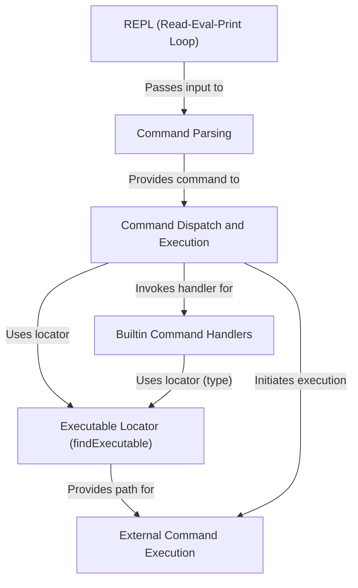

# Tutorial: shell-javascript

This project builds a simple shell (a command-line interface).
It works as a **REPL** (Read-Eval-Print Loop), constantly *waiting for you to type commands*.
When you enter something, it **parses** your input to understand the command and its arguments,
then *decides* whether it's a built-in command (like `echo` or `cd`) or an external program to run.
If it's external, it *finds the program* on your system and **runs it**, showing you the output.

## Visual Overview

## Chapters

1. [REPL (Read-Eval-Print Loop)
](01_repl__read_eval_print_loop__.md)
2. [Command Parsing
](02_command_parsing_.md)
3. [Command Dispatch and Execution
](03_command_dispatch_and_execution_.md)
4. [Builtin Command Handlers
](04_builtin_command_handlers_.md)
5. [Executable Locator (`findExecutable`)
](05_executable_locator___findexecutable___.md)
6. [External Command Execution
](06_external_command_execution_.md)

---

Generated by [AI Codebase Knowledge Builder](https://github.com/The-Pocket/Tutorial-Codebase-Knowledge).
