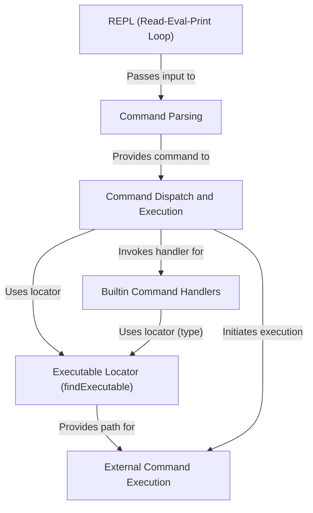
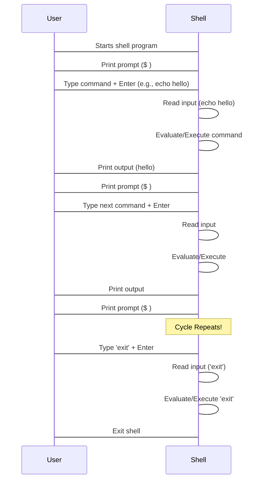
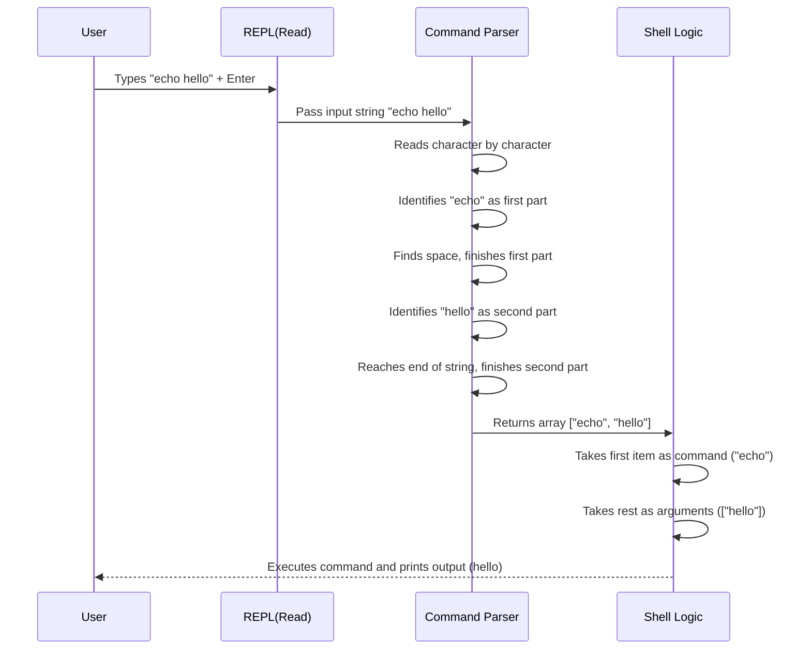
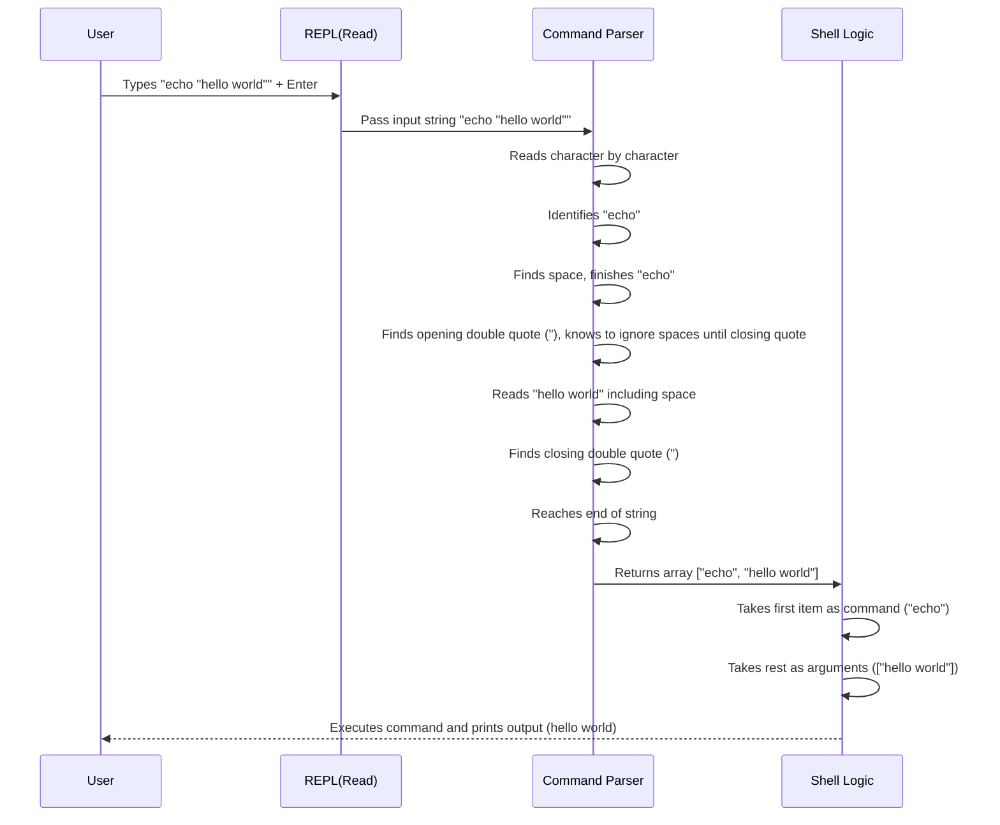
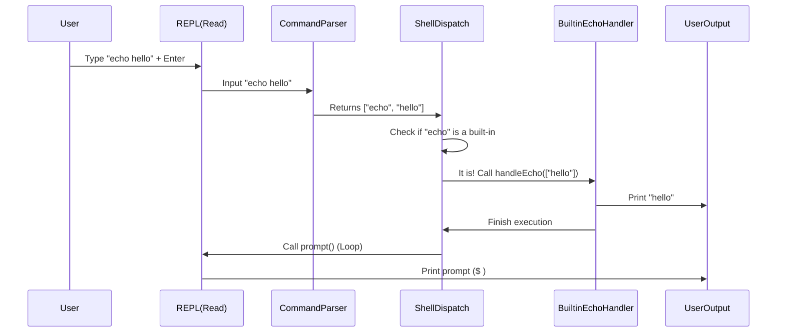
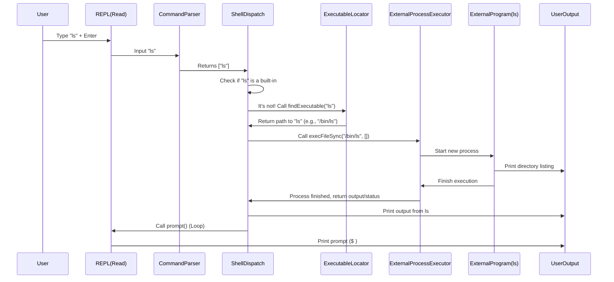
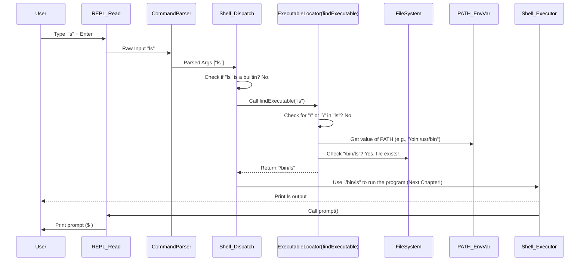
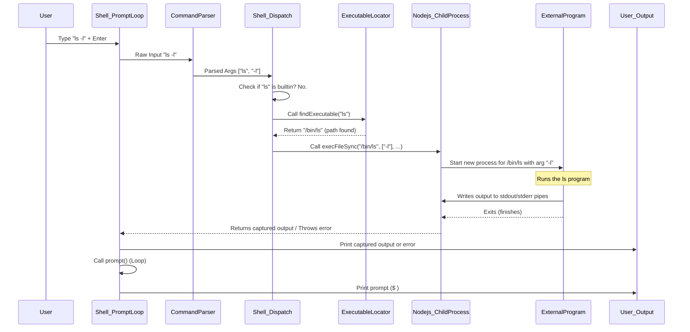

# Tutorial: shell-javascript

This project builds a simple shell (a command-line interface).
It works as a **REPL** (Read-Eval-Print Loop), constantly *waiting for you to type commands*.
When you enter something, it **parses** your input to understand the command and its arguments,
then *decides* whether it's a built-in command (like `echo` or `cd`) or an external program to run.
If it's external, it *finds the program* on your system and **runs it**, showing you the output.


## Visual Overview



## Chapters

1. [REPL (Read-Eval-Print Loop)
](01_repl__read_eval_print_loop__.md)
2. [Command Parsing
](02_command_parsing_.md)
3. [Command Dispatch and Execution
](03_command_dispatch_and_execution_.md)
4. [Builtin Command Handlers
](04_builtin_command_handlers_.md)
5. [Executable Locator (`findExecutable`)
](05_executable_locator___findexecutable___.md)
6. [External Command Execution
](06_external_command_execution_.md)

---

# Chapter 1: REPL (Read-Eval-Print Loop)

Welcome to the first chapter of building your own shell! Every time you open your terminal, you're interacting with a shell. It's the program that understands the commands you type and tells the computer what to do. But how does it work? How does it know when you've finished typing a command, and how does it give you results back?

This is where the core concept of this chapter comes in: the **REPL**, which stands for **Read-Eval-Print Loop**.

Think of the shell like a helpful assistant you're having a conversation with:

1.  **Assistant:** "Ready for your command! (shows prompt '$ ')"
2.  **You:** "Tell me my current location." (type `pwd` and press Enter)
3.  **Assistant:** "Okay, processing that..." (reads and evaluates `pwd`)
4.  **Assistant:** "Your current location is /home/user." (executes and prints the result)
5.  **Assistant:** "Ready for your *next* command! (shows prompt '$ ' again)"

This back-and-forth, where the shell waits for you, takes your input, figures it out, gives you a response, and then waits again, is the REPL cycle.

## What is the REPL?

REPL stands for:

*   **R**ead: The shell waits for you to type something and press Enter. It reads the line of text you entered.
*   **E**val (or Execute): The shell takes the input text and figures out what command you want to run and what arguments you provided. It then performs the action associated with that command.
*   **P**rint: The shell displays the result of the command (if any) back to you in the terminal.
*   **L**oop: After printing the result (or an error), the shell goes back to the "Read" step, shows the prompt, and waits for your *next* command. This cycle continues until you tell the shell to exit.

This simple, repeating cycle is the heart of almost all interactive command-line interfaces, not just shells!

## How Our Shell Implements the REPL

Let's look at how the provided code (`app/main.js`) sets up this cycle. The core of the interaction happens using Node.js's built-in `readline` module, which is perfect for building command-line interfaces.

First, we need to create an interface that handles input and output:

```javascript
const readline = require("readline");

const rl = readline.createInterface({
  input: process.stdin,
  output: process.stdout,
});

// ... rest of the code
```

This code creates an object `rl` that connects to the standard input (`process.stdin`, where you type) and standard output (`process.stdout`, where the shell prints).

Next, the main loop is started by a function, conventionally called `prompt` in shell programs, which asks for input:

```javascript
function prompt() {
  rl.question("$ ", (input) => {
    // This function runs AFTER the user types something and presses Enter

    // --- EVALUATION/EXECUTION happens here ---
    // We'll figure out what command was typed (like "echo", "exit", etc.)
    // and run the appropriate code.

    // --- PRINTING happens inside the evaluation/execution logic ---
    // For example, 'echo' will use console.log

    // --- The LOOP continues by calling prompt() again ---
    prompt();
  });
}

// Start the whole process
prompt();
```

This `prompt` function does a few key things related to the REPL:

1.  **Print (the prompt):** `rl.question("$ ", ...)` first prints the `$ ` symbol (the prompt) to show you it's ready.
2.  **Read:** It then waits for you to type a line and press Enter. When you do, the text you typed is passed as the `input` argument to the function defined inside `rl.question`.
3.  **Eval/Execute:** *Inside* that function, the code will then process the `input` string. This involves figuring out the command and running the right logic (which we'll cover in detail in later chapters like [Command Parsing](02_command_parsing_.md) and [Command Dispatch and Execution](03_command_dispatch_and_execution_.md)).
4.  **Loop:** Finally, after processing the command, the function calls `prompt()` again. This restarts the cycle, showing the `$ ` prompt and waiting for the next command.

Let's visualize this simple flow:



## A Simple Example Walkthrough

Let's trace what happens when you type `echo hello` in our shell:

1.  The `prompt()` function runs, printing `$ ` and waiting via `rl.question`.
2.  You type `echo hello` and press Enter.
3.  The `readline` module captures `"echo hello"` and calls the function provided to `rl.question` with `input` being `"echo hello"`.
4.  Inside this function, the code checks if the command is `exit`. It's not.
5.  It then checks if the command is `echo`. Yes, it is!
6.  The code calls the `handleEcho` function with the arguments (`["hello"]` after parsing, though this chapter won't detail parsing).
7.  The `handleEcho` function uses `console.log` to print `hello`. This is the **Print** step.
8.  After `handleEcho` finishes, the function passed to `rl.question` continues and calls `prompt()` again. This is the **Loop** step returning to **Read**.
9.  The shell prints `$ ` again, waiting for your next command.

You can see this basic flow in the `app/main.js` code:

```javascript
function prompt() {
  rl.question("$ ", (input) => { // <<< READ step starts here
    if (!input.trim()) {
      return prompt(); // Loop if input is empty
    }
    const args = parseArgs(input); // <<< EVALUATION starts (parsing)
    const cmd = args[0];

    // <<< EXECUTION/EVALUATION based on command
    if (cmd === "exit") {
      handleExit(args); // Handles exit, breaks the loop
    } else if (cmd === "cd") {
      handleCd(args[1]);
      prompt(); // Loop for cd
    } else if (cmd === "echo") {
      handleEcho(args.slice(1)); // <<< PRINTING happens inside handleEcho
      prompt(); // Loop for echo
    }
    // ... other commands ...
    else {
        // Handle external commands...
        // PRINTING happens via stdout from the child process
        prompt(); // Loop for external commands
    }
    // Note: prompt() is called at the end of *most* execution paths
    // to continue the LOOP. exit is the exception.
  });
}

// Start the initial prompt when the script runs
prompt(); // <<< Starts the very first READ/LOOP
```

This simplified view shows how the code structure directly implements the REPL: `rl.question` handles the Read, the `if/else if` block handles the initial part of Evaluation and triggers Execution (calling `handleEcho`, etc.), printing happens within the execution handlers, and calling `prompt()` at the end of the callback closes the loop, returning to the Read step.

## Conclusion

The REPL (Read-Eval-Print Loop) is the fundamental interaction pattern of a shell. It's a continuous cycle of waiting for user input, processing it, showing the result, and then waiting again. Our shell project starts by setting up this loop using Node.js's `readline` module.

While this chapter showed the basic structure of the loop and how input is read, we haven't yet explored *how* the shell actually understands the command you type (like separating `echo` from `hello`). That crucial step is handled by **Command Parsing**, which is the topic of our next chapter.

[Command Parsing](02_command_parsing_.md)

---

</sub> <sub><sup>**References**: [[1]](https://github.com/Asil786/shell-javascript/blob/f03975056b98f045d5b71cabcecfec24b170122b/.codecrafters/run.sh), [[2]](https://github.com/Asil786/shell-javascript/blob/f03975056b98f045d5b71cabcecfec24b170122b/README.md), [[3]](https://github.com/Asil786/shell-javascript/blob/f03975056b98f045d5b71cabcecfec24b170122b/app/main.js), [[4]](https://github.com/Asil786/shell-javascript/blob/f03975056b98f045d5b71cabcecfec24b170122b/your_program.sh)</sup></sub>
# Chapter 2: Command Parsing

In the previous chapter, [REPL (Read-Eval-Print Loop)](01_repl__read_eval_print_loop__.md), we saw how our shell constantly loops: reading your input, doing something with it, and then printing a result before waiting for the next command. The "Read" part gets a raw line of text from you, like `"echo hello world"` or `"cd /path/with spaces"`.

But how does the shell know that in `"echo hello world"`, `echo` is the command and `hello world` are the things you want to echo? And how does it handle the spaces inside a path like `/path/with spaces` if that path is put inside quotes?

This is where **Command Parsing** comes in.

Think of it like this: When you give someone instructions, you don't just give them a long, jumbled sentence. You break it down: "First, take *this object*. Second, move it *to that location*." Command parsing is the shell's way of taking your single line of text and breaking it down into structured pieces it can understand and work with.

The main goal of command parsing is to turn the raw input string into two main parts:

1.  The **command name**: The first word you typed (like `echo`, `cd`, `exit`, etc.).
2.  The **arguments**: A list of the other "words" that provide details or data for the command.

## The Challenge: Spaces and Quotes

At first glance, you might think, "Okay, I'll just split the line by spaces!" Let's try that with some examples:

*   Input: `echo hello world`
*   Split by space: `["echo", "hello", "world"]` - Looks good! `echo` is the command, `hello` and `world` are arguments.
*   Input: `cd /home/my user`
*   Split by space: `["cd", "/home/my", "user"]` - Uh oh! The path `/home/my user` should be a single argument, but splitting by spaces treated it as two. This won't work if we try to change directory to `/home/my` then `user`.

This is where quotes become important. In shells, single quotes (`'`) and double quotes (`"`) are used to group words together, preventing spaces *inside* the quotes from being treated as argument separators.

*   Input: `cd "/home/my user"`
*   What we *want*: `["cd", "/home/my user"]`
*   Input: `echo "hello world"`
*   What we *want*: `["echo", "hello world"]`

So, the parsing logic needs to understand:

*   Spaces *outside* quotes separate arguments.
*   Spaces *inside* quotes are part of the argument.
*   Quotes themselves usually aren't part of the final argument value (though there are rules about this).
*   There might be special rules for characters like `\` (backslash) inside double quotes.

## How Our Shell Parses Commands

Our shell has a special function dedicated to this task: `parseArgs`. You can see it in the `app/main.js` file. This function takes the raw input string read by the REPL and returns an array where the first element is the command name and the subsequent elements are the arguments.

Let's visualize the process for a simple command like `echo hello`:



Now let's consider `echo "hello world"`:



Notice how the command parser's job is crucial before the shell can even figure out *what* command to run or *what* data to give it.

## Looking at the Code (`parseArgs` function)

Let's peek inside the `parseArgs` function in `app/main.js`. This function implements the logic described above. It loops through the input string one character at a time and builds the arguments.

```javascript
function parseArgs(input) {
  const args = []; // Array to store the parsed arguments
  let current = ""; // String to build the current argument
  let inSingle = false; // Flag to track if we are inside single quotes
  let inDouble = false; // Flag to track if we are inside double quotes
  let i = 0; // Index to loop through the input string

  while (i < input.length) {
    const char = input[i];

    // ... logic to handle characters based on quote state ...

    i++; // Move to the next character
  }

  // Add any remaining characters in 'current' as the last argument
  if (current.length > 0) {
    args.push(current);
  }
  return args;
}
```

The core of the function is a `while` loop that goes through every character (`char`) of the input string. Inside the loop, it checks the current state (`inSingle`, `inDouble`) and the character itself to decide what to do:

*   **If inside single quotes (`inSingle` is true):**
    *   If the character is `'`, it means we've reached the closing single quote. Turn `inSingle` off.
    *   Otherwise (any other character), add the character to the `current` argument string.
*   **If inside double quotes (`inDouble` is true):**
    *   Handle potential escape sequences (`\`). If `\` is followed by `"` or `\` or `$` or ``` ` ```, add the *next* character to `current` and skip the `\` (increment `i`).
    *   If the character is `"`, it means we've reached the closing double quote. Turn `inDouble` off.
    *   Otherwise (any other character, including spaces), add the character to the `current` argument string.
*   **If outside any quotes:**
    *   If the character is `'`, we've entered single quotes. Turn `inSingle` on.
    *   If the character is `"`, we've entered double quotes. Turn `inDouble` on.
    *   If the character is a space (` `): If we've built up any characters in `current`, that means we've reached the end of an argument. Add the `current` string to the `args` array and reset `current` to an empty string. If `current` is empty (multiple spaces together), just ignore the space.
    *   If it's any other character (a regular letter, number, symbol, etc.): Add it to the `current` argument string.

After the loop finishes, there might be characters left in `current` (this happens with the last argument). The code checks `if (current.length > 0)` and pushes this last part onto the `args` array. Finally, it returns the `args` array.

## Examples of Parsing Output

Let's see what `parseArgs` would return for various inputs:

| Input String         | `parseArgs` Output Array       | Explanation                                     |
| :------------------- | :----------------------------- | :---------------------------------------------- |
| `echo hello world`   | `["echo", "hello", "world"]`   | Spaces separate arguments.                      |
| `echo "hello world"` | `["echo", "hello world"]`      | Space inside double quotes is kept.             |
| `echo 'single quotes'`| `["echo", "single quotes"]`    | Space inside single quotes is kept.             |
| `cd /tmp`            | `["cd", "/tmp"]`               | Simple command and path argument.               |
| `cd "/path/with spaces"` | `["cd", "/path/with spaces"]`| Path with spaces handled by quotes.             |
| `echo "hello\"quote"`| `["echo", "hello\"quote"]`     | Escaped quote inside double quotes is kept. (Our parser keeps the `\`, some shells remove it, but this simple version is fine for now). |
| `echo hello "world"` | `["echo", "hello", "world"]`   | Mixed unquoted and quoted arguments.            |
| `  leading space `   | `["leading", "space"]`         | Leading/trailing spaces are ignored when splitting. |

This array of strings returned by `parseArgs` is exactly what the rest of the shell needs to understand what command was requested and what information was provided.

## Using the Parsed Output in the REPL

Back in the REPL loop (the `prompt` function in `app/main.js`), after `rl.question` gets the `input` string, the very first thing it does (after checking for empty input) is call `parseArgs`:

```javascript
function prompt() {
  rl.question("$ ", (input) => {
    // ... empty input check ...

    const args = parseArgs(input); // <<< Call the parser!
    const cmd = args[0];           // <<< Get the command name (first element)

    // Now use 'cmd' and 'args' to decide what to do
    if (cmd === "exit") {
      handleExit(args);
    } else if (cmd === "cd") {
      handleCd(args[1]); // cd only cares about the *second* element (the directory)
      prompt();
    } else if (cmd === "echo") {
      handleEcho(args.slice(1)); // echo needs *all* arguments *after* the command
      prompt();
    }
    // ... and so on for other commands ...
  });
}
```

As you can see, `args[0]` is always treated as the command name. The rest of the array (`args.slice(1)`) becomes the list of arguments passed to the command handler functions like `handleEcho` or `handleCd`.

## Conclusion

Command parsing is a fundamental step that bridges the gap between the user's raw text input and the structured data (command name and arguments) that the shell needs to operate. Our `parseArgs` function handles this by iterating through the input, using flags to keep track of quote states, and correctly separating arguments while preserving spaces within quotes.

Now that we know how to break down the user's command into meaningful parts, the next question is: How does the shell figure out *which* piece of code should run for a given command like `echo` or `cd`? That's the topic of our next chapter: [Command Dispatch and Execution](03_command_dispatch_and_execution_.md).

[Command Dispatch and Execution](03_command_dispatch_and_execution_.md)

---

<sub><sup>**References**: [[1]](https://github.com/Asil786/shell-javascript/blob/f03975056b98f045d5b71cabcecfec24b170122b/app/main.js)</sup></sub>
# Chapter 3: Command Dispatch and Execution

Welcome back! In the last chapter, [Command Parsing](02_command_parsing_.md), we learned how our shell takes the raw line you type (like `echo "hello world"`) and breaks it down into a usable list of words: the command name (`echo`) and its arguments (`["hello world"]`).

Now that the shell *knows* what command you asked for, what does it do with that information? It's time for **Command Dispatch and Execution**.

Imagine you're at a busy airport, and planes are landing. Each plane has a destination. The air traffic controller needs to quickly figure out which runway or gate that specific plane needs to go to, and then make sure it gets there safely.

Our shell does something similar. After parsing, it has the "plane" (your command and arguments). It needs to act as a "traffic controller" to figure out where this command should go:

1.  Is it a command the shell itself knows how to handle directly? (Like changing directory, `cd`). These are called **built-in** commands.
2.  Is it a separate program installed somewhere else on your computer? (Like `ls` to list files, or `cat` to read a file). These are called **external** commands.

The shell needs to *dispatch* the command request to the correct handler based on whether it's built-in or external. Then, it needs to *execute* that command.

## Built-in vs. External Commands

This distinction is key in understanding how shells work:

*   **Built-in Commands:**
    *   These commands are hardcoded *inside* the shell program itself.
    *   Examples in our shell: `cd`, `echo`, `exit`, `pwd`, `type`.
    *   They are typically faster because the shell doesn't need to search for a separate file and start a new process.
    *   They can perform actions that directly affect the shell's internal state, like changing the current directory (`cd`) or exiting the shell (`exit`).

*   **External Commands:**
    *   These are separate executable programs located in files elsewhere on your computer (like `/bin/ls`, `/usr/bin/grep`, etc.).
    *   Examples you use every day: `ls`, `grep`, `cat`, `node`, `python`, `git`, etc.
    *   When you run an external command, the shell has to find its location and start a new child process to run that program.
    *   They run independently of the shell, though the shell waits for them to finish and handles their input/output.

The first step in command dispatch is always to check if the command is a built-in. Why? Because built-ins are simpler, faster, and need special handling (like `cd` changing the shell's *own* directory, which an external program couldn't do directly to the parent shell).

## The Dispatch Logic in Our Shell

Let's look at the `prompt` function in `app/main.js` again. After getting the `args` array from `parseArgs`, the very next part is the dispatch logic:

```javascript
function prompt() {
  rl.question("$ ", (input) => {
    // ... (input checks) ...

    const args = parseArgs(input); // Get command and arguments
    const cmd = args[0];           // The command name is the first element

    // --- COMMAND DISPATCH starts here ---

    if (cmd === "exit") {
      handleExit(args); // Call the built-in exit handler
    } else if (cmd === "cd") {
      handleCd(args[1]); // Call the built-in cd handler
      prompt(); // Loop continues
    } else if (cmd === "echo") {
      handleEcho(args.slice(1)); // Call the built-in echo handler
      prompt(); // Loop continues
    } else if (cmd === "pwd") {
      handlePwd(); // Call the built-in pwd handler
      prompt(); // Loop continues
    } else if (cmd === "type") {
      handleType(args[1]); // Call the built-in type handler
      prompt(); // Loop continues
    }
    // If it's NOT any of the built-ins listed above...
    else {
      // --- This is the path for EXTERNAL commands ---
      // The logic for finding and running external commands goes here.
      // We'll cover this in detail in later chapters!
      // ... findExecutable(cmd) ...
      // ... execFileSync(...) ...
      prompt(); // Loop continues after external command finishes
    }
  });
}
```

This `if/else if/else` structure *is* the command dispatch!

1.  It checks if `cmd` is exactly `"exit"`. If yes, it calls the `handleExit` function.
2.  If not, it checks if `cmd` is `"cd"`. If yes, it calls `handleCd`.
3.  ... and so on for each built-in command we've implemented (`echo`, `pwd`, `type`).
4.  If the command `cmd` doesn't match *any* of the built-in names, the code falls into the final `else` block. This `else` block is where our shell assumes it must be an **external command** and starts the process of finding and running that separate program.

## Execution (Doing the Work)

Once the shell has dispatched the command (decided if it's built-in or external), the next step is **execution**.

*   **For Built-in Commands:** Execution means calling the specific JavaScript function (`handleEcho`, `handleCd`, etc.) that contains the logic for that command. The arguments parsed in the previous step are passed to these functions. The function does its work (prints output, changes directory, etc.).
*   **For External Commands:** Execution is much more complex. The shell must:
    *   Find the actual file on the computer that contains the program code (e.g., find where `ls` is located). This is handled by the `findExecutable` function, which we'll explore in [Executable Locator (`findExecutable`)](05_executable_locator___findexecutable___.md).
    *   Start a new process to run that program file. This involves system calls to the operating system. In Node.js, this is typically done using functions from the `child_process` module, like `execFileSync`. We'll dive into this in [External Command Execution](06_external_command_execution_.md).
    *   Wait for the external program to finish.
    *   Handle any output (like text printed to the console) or errors from the external program.

## Step-by-Step Flow

Let's trace two examples to see the dispatch and execution in action:

**Example 1: `echo hello` (Built-in)**



**Example 2: `ls` (External - assuming `ls` is not a built-in in our simple shell)**



You can see how the dispatch step (`ShellDispatch`) acts as the central switchboard, routing the command request down different paths depending on whether it's a built-in or something that needs to be found and run externally.

## Connecting to Previous and Next Chapters

*   The **Command Parsing** chapter ([02_command_parsing_.md](02_command_parsing_.md)) provides the `args` array that Command Dispatch uses (`args[0]` for the command name, `args.slice(1)` for arguments).
*   If the dispatch determines the command is external, it relies on the logic from **Executable Locator (`findExecutable`)** ([05_executable_locator___findexecutable___.md]) to find the program file and **External Command Execution** ([06_external_command_execution_.md]) to run it.

The dispatch logic ties the parsing step (understanding the command) to the execution steps (actually *doing* the command).

## Conclusion

Command Dispatch and Execution is the core logic loop that takes the parsed command and decides *what* code or program to run and then makes it happen. It starts by checking for built-in commands (like `cd`, `echo`, `exit`, etc.) which are handled directly by functions within the shell code. If the command is not a built-in, the shell *dispatches* the request down the path for external commands, which involves finding the executable file and running it as a separate process.

This chapter explained the distinction between built-ins and externals and showed where this decision happens in our shell's code. The next logical step is to understand *how* the shell finds the actual program file on the system when you type an external command like `ls`. That's the focus of our next chapter: [Executable Locator (`findExecutable`)](05_executable_locator___findexecutable___.md).

[Executable Locator (`findExecutable`)](05_executable_locator___findexecutable___.md)

---

</sub> <sub><sup>**References**: [[1]](https://github.com/Asil786/shell-javascript/blob/f03975056b98f045d5b71cabcecfec24b170122b/app/main.js)</sup></sub>

# Chapter 4: Builtin Command Handlers

In the last chapter, [Command Dispatch and Execution](03_command_dispatch_and_execution_.md), we saw how our shell takes your parsed command and decides where to send it. The dispatch logic acts like a traffic controller, checking if the command is something the shell handles directly or if it's a separate program somewhere else on your system.

This chapter focuses on the first case: commands that the shell handles *directly*. These are called **Builtin Command Handlers**.

Think of your shell program like a toolbox. It contains many different tools you can use. Some of these tools are things you find outside the box, like a big power drill you have to go grab from the garage (external commands). But some essential, frequently used tools are kept *right inside* the main toolbox itself, maybe clipped to the lid or sitting in a top tray (builtin commands). You can grab these without even closing the main box.

Builtin commands are like those essential tools inside the toolbox. They are pieces of code written directly into our shell's main program file (`app/main.js`). When you type a builtin command, the shell doesn't need to search for a separate program file or start a new process. It just runs a specific function it already has loaded in memory.

## Why Have Builtin Commands?

There are a few main reasons why certain commands are built-in rather than external programs:

1.  **Speed:** Running a function directly in the current process is much faster than finding a file on disk and starting a whole new separate process.
2.  **Access to Shell State:** Builtin commands can directly interact with and change the shell's internal state. The most classic example is `cd` (change directory). An external program runs in its *own* process, and changing *its* directory wouldn't affect the shell's directory where you type commands. Only a builtin `cd` can change the directory of the shell process itself. Similarly, `exit` needs to be a builtin to terminate the shell process.
3.  **Simplicity:** For simple tasks like printing text (`echo`) or showing the current directory (`pwd`), it's often easier to implement them directly within the shell rather than relying on external programs.

## Our Shell's Builtin Commands

Our simple shell supports a few common builtin commands:

*   `cd`: Change the current working directory.
*   `echo`: Print text to the console.
*   `exit`: Terminate the shell.
*   `pwd`: Print the current working directory.
*   `type`: Tell you if a command is a builtin or an external program, and where the external program is found.

## How Builtins are Dispatched

As we saw in Chapter 3, the `prompt` function contains the core dispatch logic. After calling `parseArgs`, it gets the command name (`cmd = args[0]`). It then uses a series of `if/else if` checks to see if `cmd` matches any of the known builtin names:

```javascript
function prompt() {
  rl.question("$ ", (input) => {
    // ... input checks ...
    const args = parseArgs(input);
    const cmd = args[0];

    // --- Dispatch Logic (checks for builtins first) ---
    if (cmd === "exit") {
      handleExit(args); // Call the builtin handler for 'exit'
    } else if (cmd === "cd") {
      handleCd(args[1]); // Call the builtin handler for 'cd'
      prompt();
    } else if (cmd === "echo") {
      handleEcho(args.slice(1)); // Call the builtin handler for 'echo'
      prompt();
    } else if (cmd === "pwd") {
      handlePwd(); // Call the builtin handler for 'pwd'
      prompt();
    } else if (cmd === "type") {
      handleType(args[1]); // Call the builtin handler for 'type'
      prompt();
    } else {
      // If none of the above match, it's treated as an external command...
      // ... (external command handling code) ...
    }
    // prompt() is called here or within handlers to continue the loop
  });
}
```

This is where the "Builtin Command Handler" concept comes into play. Each `else if` block that finds a builtin command calls a specific JavaScript function designed to handle *only* that command.

## The Builtin Handlers (Execution)

The actual logic for each builtin lives in separate functions within `app/main.js`. Let's look at a couple of examples.

### `echo`: Printing Text

The `echo` command simply prints its arguments to the standard output.

*   **User input:** `echo hello world`
*   **Parsed args:** `["echo", "hello", "world"]`
*   **Dispatch:** The `else if (cmd === "echo")` block is true.
*   **Execution:** The shell calls `handleEcho` and passes the arguments *after* `echo`, which is `["hello", "world"]`.

The `handleEcho` function is very straightforward:

```javascript
function handleEcho(args) {
  // args will be the array of words *after* "echo", e.g., ["hello", "world"]
  // We join them with spaces and print them.
  console.log(args.join(" "));
}
```

It takes the array of arguments, joins them back together into a single string with spaces in between, and uses `console.log` to print the result. This is a perfect example of a simple task handled directly by the shell's code.

### `pwd`: Printing the Current Directory

The `pwd` command stands for "print working directory". It tells you where you are in the file system.

*   **User input:** `pwd`
*   **Parsed args:** `["pwd"]`
*   **Dispatch:** The `else if (cmd === "pwd")` block is true.
*   **Execution:** The shell calls `handlePwd`. It doesn't need any arguments from the user.

The `handlePwd` function uses Node.js's built-in `process.cwd()` function, which returns the current working directory of the Node.js process (our shell):

```javascript
function handlePwd() {
  // process.cwd() returns the current working directory of the Node.js process
  console.log(process.cwd());
}
```

Again, a simple task handled internally.

### `cd`: Changing Directory

The `cd` command changes your location in the file system. As mentioned before, this *must* be a builtin.

*   **User input:** `cd /tmp`
*   **Parsed args:** `["cd", "/tmp"]`
*   **Dispatch:** The `else if (cmd === "cd")` block is true.
*   **Execution:** The shell calls `handleCd` and passes the *first* argument after `cd` (`/tmp` in this case).

The `handleCd` function uses Node.js's `process.chdir()` function:

```javascript
const path = require("path"); // Needed for path resolution
const fs = require("fs");   // Needed to check if directory exists
const os = require("os");   // Needed for os.homedir()

function handleCd(dir) {
  // If no directory is given or it's just "~", default to the user's home directory
  if (!dir || dir === "~") {
    dir = os.homedir();
  }

  // Resolve the path relative to the current directory
  const newPath = path.resolve(process.cwd(), dir);

  // Check if the path exists AND is actually a directory
  if (fs.existsSync(newPath) && fs.statSync(newPath).isDirectory()) {
    // Use process.chdir() to change the current working directory of the shell process
    process.chdir(newPath);
  } else {
    // If it doesn't exist or isn't a directory, print an error
    console.log(`cd: ${dir}: No such file or directory`);
  }
}
```

This function is slightly more complex as it handles cases like changing to the home directory (`~`), resolves the path correctly, and checks if the target exists and is a directory before attempting the change. The crucial part is `process.chdir(newPath)`, which directly changes the shell's own current directory. An external program couldn't do this for the shell.

### Other Builtins (`exit`, `type`)

The `exit` command also has a simple handler (`handleExit`) that uses Node.js's `process.exit()` to terminate the process. The `type` command's handler (`handleType`) checks if the given command name is in our list of builtins *first*, and *then* uses the `findExecutable` logic (which we'll see in the next chapter) if it's not a builtin. This confirms its nature to the user.

## Visualizing Builtin Execution

Let's see the flow for a builtin command, focusing on the dispatch leading to the handler:

```mermaid
sequenceDiagram
    participant User
    participant REPL_Read
    participant CommandParser
    participant Shell_Dispatch
    participant BuiltinHandler(e.g.,handleEcho)
    participant User_Output

    User->>REPL_Read: Type command + Enter (e.g., echo hello)
    REPL_Read->>CommandParser: Raw Input string
    CommandParser->>Shell_Dispatch: Parsed Args (["echo", "hello"])
    Shell_Dispatch->>Shell_Dispatch: Check if args[0] ("echo") is a known builtin?
    Shell_Dispatch->>BuiltinHandler(e.g.,handleEcho): Yes, call appropriate handler (handleEcho) with arguments (["hello"])
    BuiltinHandler(e.g.,handleEcho)->>User_Output: Perform action (e.g., console.log)
    BuiltinHandler(e.g.,handleEcho)->>Shell_Dispatch: Handler finishes
    Shell_Dispatch->>REPL_Read: Continue the loop (call prompt())
    REPL_Read->>User_Output: Print prompt ($ )
```

This diagram shows the direct path: Input -> Parse -> Dispatch (check builtin list) -> Execute Builtin Handler -> Finish -> Loop. It avoids the extra steps needed for external commands like searching for a file and starting a new process.

## Conclusion

Builtin command handlers are specific functions built directly into our shell program to handle common and essential commands like `cd`, `echo`, `pwd`, `type`, and `exit`. They are faster and allow for direct manipulation of the shell's state, which is crucial for commands like changing directories. The shell's dispatch logic checks for these builtins first, executing their dedicated handler functions before considering external programs.

Now that we understand how the shell handles commands it knows internally, the next question is: What happens when you type a command that *isn't* a builtin? How does the shell find where the program for that command is located on your computer? That's the topic of our next chapter: [Executable Locator (`findExecutable`)](05_executable_locator___findexecutable___.md).

[Executable Locator (`findExecutable`)](05_executable_locator___findexecutable___.md)

---

<sub><sup>**References**: [[1]](https://github.com/Asil786/shell-javascript/blob/f03975056b98f045d5b71cabcecfec24b170122b/app/main.js)</sup></sub>
# Chapter 5: Executable Locator (`findExecutable`)

Welcome back! In the last chapter, [Builtin Command Handlers](04_builtin_command_handlers_.md), we learned about commands like `cd` and `echo` that are handled directly by code *inside* our shell program. But what about commands like `ls` or `cat` that aren't built-in? These are separate programs located somewhere on your computer.

When you type a command that isn't a builtin, the shell needs to answer a crucial question: "Okay, I know you want to run `ls`, but *where* is the `ls` program file on this computer?"

This is the job of the **Executable Locator**, specifically the `findExecutable` function in our project. Its purpose is to figure out the full path to the program file you want to run.

Think of it like wanting to call a friend. First, you check your contacts list (the built-in commands you know by heart). If your friend isn't there, you need to look up their address. Do you have their exact address? Or do you only have their name and need to look through a directory or address book (like the system's `PATH`) to find their address? `findExecutable` is like looking up that address.

## How `findExecutable` Works: Two Ways to Find a Program

When you give the shell a command that isn't a builtin, `findExecutable` tries to find it using two main methods, in this order:

1.  **Is it a Direct Path?** It first checks if the command name you typed looks like a direct location on the file system. For example, if you type `/bin/ls` or `./my_script.sh`.
2.  **Search the `PATH`:** If the command name *doesn't* look like a direct path (like just typing `ls` or `cat`), the shell searches through a list of standard directories where programs are typically stored. This list is stored in a special **environment variable** called `PATH`.

Let's look at these two methods in a bit more detail.

### Method 1: Checking for a Direct Path

If the command string contains characters that indicate a directory structure (`/` on Linux/macOS or `\` on Windows), the shell assumes you are giving it a specific file path, not just a name.

For example, typing:

*   `/bin/ls`
*   `/usr/local/bin/mytool`
*   `./scripts/cleanup.sh`
*   `C:\Windows\System32\cmd.exe` (on Windows)

In these cases, the shell doesn't need to search anywhere. You've already given it the "address". The `findExecutable` function just needs to:

1.  Take the path you provided.
2.  Make sure it's a full, absolute path (by resolving it relative to the current directory if it's a relative path like `./scripts/...`).
3.  Check if a file *actually exists* at that exact location.

If a file exists there, that's the executable, and `findExecutable` returns that full path. If not, it means you gave a specific path, but there's nothing there, so this method fails, and `findExecutable` will return `null`.

### Method 2: Searching the `PATH`

Most of the time, you don't type the full path to commands. You just type `ls`, `grep`, `cat`, etc. How does the shell find `ls` if it could be in `/bin`, `/usr/bin`, or other places? This is where the `PATH` environment variable comes in.

The `PATH` is simply a string containing a list of directories, separated by a special character (`;` on Windows, `:` on Linux/macOS). It looks something like this (example from Linux):

`/usr/local/sbin:/usr/local/bin:/usr/sbin:/usr/bin:/sbin:/bin`

When `findExecutable` needs to find a command name (like `ls`) that *isn't* a direct path, it does the following:

1.  Get the value of the `PATH` environment variable.
2.  Split the `PATH` string into individual directory paths using the separator character (which `path.delimiter` gives us in Node.js).
3.  Go through this list of directories *one by one*, from left to right.
4.  In each directory, it constructs a potential path by joining the directory path and the command name (e.g., `/usr/local/sbin/ls`).
5.  It checks if a file exists at this potential path.
6.  **The first time** it finds a file that exists, that's the executable! `findExecutable` returns that full path immediately and stops searching.
7.  If it goes through *all* the directories in the `PATH` and doesn't find a file with the command name, then the command is not found, and `findExecutable` returns `null`.

This is why the order of directories in your `PATH` matters! If you have two programs with the same name in different directories listed in `PATH`, the shell will run the one found in the directory listed *first*.

## Looking at the `findExecutable` Code

Let's look at the `findExecutable` function in `app/main.js`. It implements the logic described above.

```javascript
function findExecutable(command) {
  // ... (code to handle quotes is here, we'll simplify for focus) ...
  let unquotedCommand = command; // Assume quotes are handled

  // Method 1: Check if it's a direct path
  if (unquotedCommand.includes("/") || unquotedCommand.includes("\\")) {
    const resolvedPath = path.resolve(process.cwd(), unquotedCommand);
    if (fs.existsSync(resolvedPath)) {
      return resolvedPath; // Found it directly!
    }
    return null; // Looked for direct path, but file not found there
  }

  // Method 2: Search in PATH
  // Get the PATH variable and split it into directories
  const paths = process.env.PATH.split(path.delimiter);
  
  // Loop through each directory in PATH
  for (const p of paths) {
    const candidate = path.join(p, unquotedCommand); // Construct potential path
    if (fs.existsSync(candidate)) { // Check if file exists at this path
      return candidate; // Found it in PATH! Return the full path.
    }
  }

  return null; // Went through all PATH directories, command not found
}
```

This simplified snippet shows the core flow:

1.  It first checks `if (unquotedCommand.includes("/") || unquotedCommand.includes("\\"))`. If true, it tries Method 1: resolve the path and check existence.
2.  If Method 1 doesn't return a path (because the check was false or `existsSync` failed), it proceeds to Method 2.
3.  It gets `process.env.PATH`, splits it, and loops through each directory `p`.
4.  Inside the loop, it uses `path.join(p, unquotedCommand)` to build the full path (e.g., "/bin" + "ls" becomes "/bin/ls").
5.  It checks `fs.existsSync(candidate)`. If true, it returns that path.
6.  If the loop finishes without finding anything, it returns `null`.

*(Note: The actual `findExecutable` in the code also has logic to remove outer quotes from the command name before checking paths, but the core path/PATH search logic is as described above)*.

## Using `findExecutable` in the Shell

Back in our main `prompt` loop (`app/main.js`), after checking all the built-in commands, the `else` block is where external commands are handled. This is where `findExecutable` is called:

```javascript
function prompt() {
  rl.question("$ ", (input) => {
    // ... input checks and parseArgs ...
    const args = parseArgs(input);
    const cmd = args[0];

    // --- Dispatch Logic (checks builtins first) ---
    if (cmd === "exit") {
      handleExit(args);
    } else if (cmd === "cd") {
      handleCd(args[1]);
      prompt();
    }
    // ... other builtins ...
    else { // This is where we handle external commands
      // Call findExecutable to find the program file!
      const exePath = findExecutable(cmd);

      if (!exePath) {
        // If findExecutable returned null, the command wasn't found anywhere
        console.log(`${cmd}: command not found`);
        prompt(); // Continue the loop
        return;
      }

      // --- If we found the executable (exePath has a value) ---
      // Now we know where the program is, the next step is to run it.
      // This is handled in the External Command Execution step (Chapter 6).
      // ... execFileSync(exePath, args.slice(1), ...) ...

      prompt(); // Continue the loop after external execution
    }
  });
}
```

As you can see, `findExecutable(cmd)` is called with the command name (`ls`, `cat`, etc.). The result is stored in `exePath`. If `exePath` is `null` (or falsy), it means the command wasn't found, and the shell prints "`command not found`". If `exePath` *does* contain a path, the shell now knows exactly which file to run.

## Visualizing the Flow for External Commands

Let's put `findExecutable` into the flow for an external command like `ls`:



In this diagram, `findExecutable` interacts with the `PATH_EnvVar` and the `FileSystem` to locate the program file. Once found, it returns the path back to the shell's dispatch logic, which then proceeds to actually *run* the program (handled by `Shell_Executor` which we'll see next).

## Example: Using the `type` Builtin

Our `type` builtin command (covered in Chapter 4) actually uses `findExecutable` internally! When you type `type <command_name>`, it first checks if `<command_name>` is a builtin. If not, it calls `findExecutable(<command_name>)` and reports the path if found.

Let's see some outputs using the `type` command:

```bash
$ type echo
echo is a shell builtin
```
*(Here, `type` checked its internal list and found `echo`)*

```bash
$ type ls
ls is /bin/ls
```
*(Here, `type` didn't find `ls` in its builtin list, called `findExecutable("ls")`, which searched the PATH and found it at `/bin/ls`)*

```bash
$ type /bin/cat
/bin/cat is /bin/cat
```
*(Here, `type` didn't find `/bin/cat` in its builtin list, called `findExecutable("/bin/cat")`, which recognized the direct path and verified it exists)*

```bash
$ type non_existent_command
non_existent_command: not found
```
*(Here, `type` didn't find `non_existent_command` in its builtin list, called `findExecutable("non_existent_command")`, which searched the PATH and found nothing)*

These examples show `findExecutable` doing its job of locating the program file based on whether you provide a direct path or rely on the `PATH` search.

## Conclusion

The `findExecutable` function is a crucial part of handling external commands. It acts as the shell's locator service, figuring out the full file system path to the program you want to run. It does this by first checking if the command name is a direct path and verifying its existence, and if not, by searching through the directories listed in the system's `PATH` environment variable until it finds a matching executable file.

Once `findExecutable` successfully finds the path to the program, the shell knows *what* file to run. The next challenge is actually *running* that external program as a separate process and managing its input, output, and errors. That's the topic of our final chapter: [External Command Execution](06_external_command_execution_.md).

[External Command Execution](06_external_command_execution_.md)

---

<sub><sup>**References**: [[1]](https://github.com/Asil786/shell-javascript/blob/f03975056b98f045d5b71cabcecfec24b170122b/.codecrafters/run.sh), [[2]](https://github.com/Asil786/shell-javascript/blob/f03975056b98f045d5b71cabcecfec24b170122b/app/main.js), [[3]](https://github.com/Asil786/shell-javascript/blob/f03975056b98f045d5b71cabcecfec24b170122b/your_program.sh)</sup></sub>

# Chapter 6: External Command Execution

Welcome to the final core concept chapter of our shell tutorial! In the previous chapter, [Executable Locator (`findExecutable`)](05_executable_locator___findexecutable___.md), we learned how our shell figures out *where* an external command, like `ls` or `cat`, is located on your computer by searching the `PATH`.

Now that our shell knows the full path to the program file (e.g., `/bin/ls`), the next and final step is to actually *run* that program. This is the concept of **External Command Execution**.

You might wonder, "Why is this a separate step? Can't the shell just 'run' the program like it runs its own `echo` function?"

The answer is no! When you run `echo`, you are running a function *inside* the shell program itself. But `ls` or `cat` are completely separate programs, contained in different files. Our shell program cannot just magically jump into another program's code and run it. It needs to ask the operating system to start that other program as a new, independent task.

Think of it like being the manager of a team. You have tasks you do yourself (builtins). But for bigger or different tasks, you need to *delegate* them to someone else on your team (external commands). You tell the team member *what* task to do (the command name), give them any necessary instructions (the arguments), and then you might wait for them to finish before you continue with your own work.

Running an external command in a shell works the same way:

1.  The shell identifies the task (command).
2.  It finds the "team member" (the external program file) using [Executable Locator (`findExecutable`)](05_executable_locator___findexecutable___.md).
3.  It tells the operating system (like asking the overall team manager) to start this team member working on the task. This involves creating a **new process**.
4.  The shell waits for the new process (the external command) to complete its task.
5.  While the external command is running, the shell usually connects its own input and output so you can type into the external command if needed, and see the results it prints.

## What is a Process?

In simple terms, a **process** is an instance of a running program. When you double-click a program icon, the operating system starts a new process for it. When our shell program starts, it runs in one process. When it runs an external command like `ls`, the operating system creates a *second*, separate process specifically for `ls`. This second process is called a **child process** of the shell process (which is the **parent process**).

Running external commands always involves starting a child process.

## Executing the Child Process in Node.js

In Node.js, we can interact with the operating system to create and manage child processes using the built-in `child_process` module. There are several functions in this module for different needs (running commands, running files, running shell commands, etc.).

For running a specific executable file and waiting for it to finish, a common and relatively simple function is `execFileSync`.

Let's look at what `execFileSync` does:

*   It takes the full path to the executable file as the first argument.
*   It takes an array of arguments to pass to the program as the second argument.
*   It can take an options object to control how the process runs (environment variables, working directory, how to handle input/output, etc.).
*   Crucially, `execFileSync` is **synchronous**. This means the Node.js program (our shell) will *pause* and wait at the line where `execFileSync` is called until the child process (the external command) finishes running.
*   Once the child process finishes, `execFileSync` returns the standard output printed by the child process.
*   If the child process encounters an error or exits with a non-zero status code (which indicates a problem), `execFileSync` will throw an error in our Node.js code, which we can catch.

This synchronous waiting behavior is typical for how command-line shells work: they run one command, wait for it, and then show you the prompt again, ready for the next command.

## Looking at the Code (`execFileSync`)

Let's revisit the `prompt` function in `app/main.js` where we handle external commands. This is the `else` block that runs when the command is *not* a builtin.

```javascript
function prompt() {
  rl.question("$ ", (input) => {
    // ... input checks and parseArgs ...
    const args = parseArgs(input);
    const cmd = args[0];

    // --- Dispatch Logic (checks builtins first) ---
    // ... (builtin checks like exit, cd, echo, pwd, type) ...

    else { // This is where we handle external commands
      // 1. Find the executable path (from Chapter 5)
      const exePath = findExecutable(cmd);
      if (!exePath) {
        console.log(`${cmd}: command not found`);
        prompt(); // Continue the loop
        return;
      }

      // 2. If found, execute the external command!
      try {
        // --- EXECUTION happens here ---
        const out = execFileSync(exePath, args.slice(1), {
          encoding: 'utf-8', // Decode output as text
          stdio: 'pipe'      // Capture standard output and standard error
        });
        // --- After execution finishes (execFileSync returns) ---
        
        // 3. Print the captured output
        process.stdout.write(out);
      } catch (err) {
        // 4. Handle errors (like command not found or program errors)
        if (err.stdout) process.stdout.write(err.stdout); // Print any output before error
        if (err.stderr) process.stderr.write(err.stderr); // Print errors sent to stderr
        else console.error(err.message); // Print other error messages (like the program not existing)
      }
      
      // 5. Continue the REPL loop
      prompt();
    }
  });
}
```

Let's break down the part that handles execution:

1.  `const exePath = findExecutable(cmd);`: This is the call to our function from the previous chapter. It finds the full path to the program file. If `exePath` is `null`, we print "command not found" and loop (`prompt()`).
2.  `try { ... } catch (err) { ... }`: We wrap the execution code in a `try...catch` block because `execFileSync` will throw an error if the program cannot be run for some reason (e.g., permissions issues) or if the program itself exits with an error status.
3.  `const out = execFileSync(exePath, args.slice(1), { ... });`: This is the core line!
    *   `exePath`: The full path to the program file we found (e.g., `/bin/ls`).
    *   `args.slice(1)`: This gives us an array of all the arguments *after* the command name. For `ls -l`, this would be `["-l"]`. For `cat file1.txt file2.txt`, this would be `["file1.txt", "file2.txt"]`.
    *   `{ encoding: 'utf-8', stdio: 'pipe' }`: This is the options object.
        *   `encoding: 'utf-8'`: Tells Node.js to interpret the output from the child process as standard text using UTF-8 encoding.
        *   `stdio: 'pipe'`: This is important. It tells Node.js to "pipe" (capture) the child process's standard output and standard error, rather than letting them print directly to the user's terminal. By capturing them, `execFileSync` can return the standard output in the `out` variable and include standard error in the `err` object if an error occurs. *(There are other `stdio` options, but 'pipe' is common for capturing output).*
4.  `process.stdout.write(out);`: If `execFileSync` finishes successfully (no error thrown), the captured standard output is stored in the `out` variable. We then use `process.stdout.write` to print this output to our shell's standard output, so the user sees it. `write` is used instead of `console.log` because `console.log` always adds a newline at the end, which might not be desired if the external command doesn't print one.
5.  `catch (err) { ... }`: If `execFileSync` throws an error:
    *   `if (err.stdout) process.stdout.write(err.stdout);`: Sometimes, a program prints *some* output to standard output before exiting with an error. This line checks if any such output was captured and prints it.
    *   `if (err.stderr) process.stderr.write(err.stderr);`: Programs often print error messages to standard *error*. This line checks if any error messages were captured and prints them to our shell's standard error.
    *   `else console.error(err.message);`: If there's no captured `stdout` or `stderr` in the error object, we print the generic error message provided by Node.js (like "command not found" if `execFileSync` couldn't even start the process, though our `findExecutable` check should prevent that specific message here). `console.error` is typically used for error messages.
6.  `prompt();`: Whether the command succeeded or failed, as long as the shell itself didn't crash or exit, we call `prompt()` to show the `$ ` prompt again and wait for the next command, completing the REPL loop.

## Visualizing External Command Execution

Let's refine our sequence diagram to show the execution phase after the executable path is found:



This diagram shows the complete flow for an external command: from user input, through parsing and dispatch, finding the executable, using `execFileSync` to start a new process for it, the external program doing its work and sending output back via pipes, `execFileSync` capturing that, the shell printing it, and finally the loop continuing.

## Example Walkthrough: Running `ls -l`

Let's trace the example `ls -l`:

1.  You type `ls -l` and press Enter.
2.  The REPL ([REPL (Read-Eval-Print Loop)](01_repl__read_eval_print_loop__.md)) reads the input.
3.  [Command Parsing](02_command_parsing_.md) parses `"ls -l"` into `["ls", "-l"]`.
4.  [Command Dispatch and Execution](03_command_dispatch_and_execution_.md) starts. It checks if `ls` is a builtin. It's not.
5.  It proceeds to the `else` block for external commands.
6.  [Executable Locator (`findExecutable`)](05_executable_locator___findexecutable___.md) is called with `"ls"`. It searches the `PATH`, finds `/bin/ls` (or similar), and returns this path.
7.  The shell now knows the path is `/bin/ls` and the arguments are `["-l"]`.
8.  The shell calls `execFileSync("/bin/ls", ["-l"], { encoding: 'utf-8', stdio: 'pipe' })`.
9.  Node.js's `child_process` module asks the operating system to start a new process running `/bin/ls` and pass `"-l"` as an argument to it. The OS does this.
10. The `/bin/ls` program runs in its own process. It lists the directory contents in long format (`-l`) and prints the result to its standard output. Because we set `stdio: 'pipe'`, this output is captured by `execFileSync` instead of going directly to your terminal.
11. The `/bin/ls` program finishes and exits.
12. `execFileSync` detects the program finished, collects the captured output, and returns it. The captured output (the directory listing) is stored in the `out` variable.
13. The shell code `process.stdout.write(out)` prints the directory listing to your terminal.
14. The `try` block finishes successfully.
15. `prompt()` is called, showing `$ ` again, ready for the next command.

If you typed a command that failed, like `cat non_existent_file.txt`, the `cat` program would print an error message to its standard *error* and exit with a non-zero status. `execFileSync` would catch this, the error message would likely be in `err.stderr`, and our `catch` block would print that error message.

## Conclusion

Executing external commands is fundamental to a shell's power. It involves creating a new child process using operating system features. In our Node.js shell, we use the `child_process` module, specifically `execFileSync`, to run the program file found by `findExecutable`, pass it the correct arguments, wait for it to finish, and handle its output and errors.

This chapter completes our journey through the core concepts of how a simple shell works: from reading your input ([REPL (Read-Eval-Print Loop)](01_repl__read_eval_print_loop__.md)), breaking it down ([Command Parsing](02_command_parsing_.md)), deciding what to do ([Command Dispatch and Execution](03_command_dispatch_and_execution_.md)), handling commands built into the shell ([Builtin Command Handlers](04_builtin_command_handlers_.md)), finding external programs ([Executable Locator (`findExecutable`)](05_executable_locator___findexecutable___.md)), and finally, running those external programs in separate processes (this chapter).

You now have a solid understanding of the basic mechanisms that power command-line shells!

---
<sub><sup>**References**: [[1]](https://github.com/Asil786/shell-javascript/blob/f03975056b98f045d5b71cabcecfec24b170122b/app/main.js)</sup></sub>
